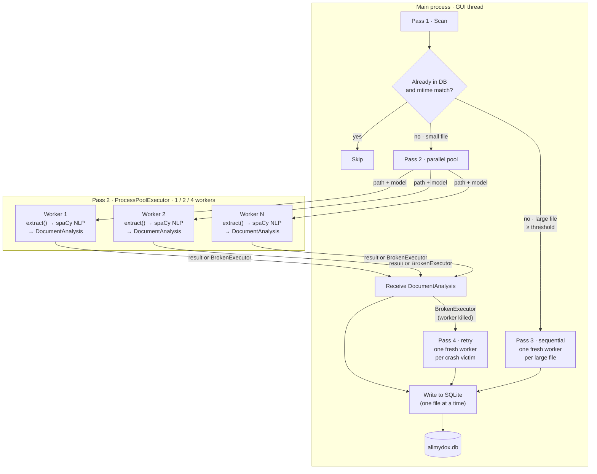
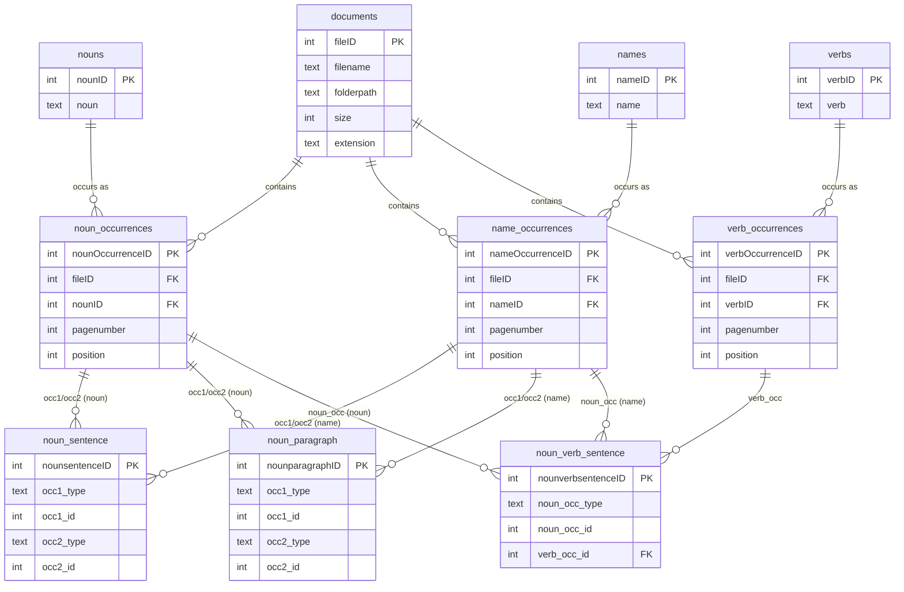

# allmydox

Scans a folder of documents and indexes every noun, proper name, and verb into a SQLite database — including the page and character position of each occurrence and co-occurrence relationships at sentence and paragraph level.

Supported document formats: **PDF**, **DOC**, **DOCX**, **XLS**, **XLSX**, **TXT**, **HTML**, **HTM**

---

## Requirements

- Python 3.9 or newer
- Internet access (first-time setup only, to download the language model)

---

## Setup

Run the setup script once before first use:

```bash
bash setup.sh
```

This installs all Python dependencies (`spacy`, `pymupdf`, `python-docx`, `openpyxl`, `xlrd`, `PyQt6`) and downloads the default German language model (`de_core_news_sm`).

For a different language, pass the spaCy model name as an argument:

```bash
bash setup.sh de_core_news_sm    # German
bash setup.sh fr_core_news_sm    # French
```

A full list of available models is at <https://spacy.io/models>.

---

## Usage

### Index a folder

```bash
python3 main.py process <directory>
```

Recursively scans `<directory>` for PDF, DOC, DOCX, XLS, XLSX, TXT, HTML, and HTM files and writes results to `allmydox.db` in the current folder. Documents already in the database are skipped automatically; documents whose file has changed since the last run are re-indexed.

**Options**

| Option | Default | Description |
|--------|---------|-------------|
| `--db PATH` | `allmydox.db` | Path to the SQLite database file |
| `--ext EXT …` | `pdf doc docx xls xlsx txt html htm` | File extensions to include |
| `--model MODEL` | `en_core_web_sm` | spaCy language model to use |
| `--reindex-changed` | on | Re-index files whose modification time changed |
| `--no-reindex-changed` | — | Skip already-indexed files regardless of changes |

**Examples**

```bash
# Index all documents in ~/Documents
python3 main.py process ~/Documents

# Use a custom database path
python3 main.py --db ~/myindex.db process ~/Documents

# Index only PDFs
python3 main.py process ~/Documents --ext pdf

# Index with a German language model
python3 main.py process ~/Dokumente --model de_core_news_sm
```

### Show row counts

```bash
python3 main.py stats
python3 main.py --db ~/myindex.db stats
```

---

## Architecture — parallel indexing pipeline

allmydox processes documents in four passes to maximise throughput while
protecting against out-of-memory crashes from large files:



**Pass 1 — scan** *(sequential, fast):* the main thread checks every file
against the database by modification time. Unchanged files are skipped.
New or changed files are sorted into two queues: files below the sequential
threshold go to the parallel queue; files at or above it go to the sequential
queue.

**Pass 2 — parallel NLP** *(concurrent):* small files are submitted to a
`ProcessPoolExecutor`. Each worker runs `extractor.extract()` then
`analyze_document()` and returns a serialisable `DocumentAnalysis` — lists of
token tuples with local indices, no database IDs. The main thread writes each
result to SQLite as futures complete. If a worker is killed by the OS
(e.g. OOM on a large PDF), `BrokenExecutor` is caught per-future; affected
files are queued for Pass 4 rather than counted as permanent errors.

**Pass 3 — sequential NLP for large files** *(isolated):* each large file runs
in its own fresh `ProcessPoolExecutor(max_workers=1)` with a 300-second
timeout. A crash on one file cannot affect any other.

**Pass 4 — retry** *(isolated):* files that received `BrokenExecutor` in Pass 2
are retried here, again one per fresh pool. Files that were innocent bystanders
of a crashed pool get a second chance; the file that caused the crash will
either succeed or be logged as a final error.

**DB writes** are always performed by the main thread, one file at a time.
SQLite WAL mode ensures no locking contention and no data corruption even when
worker processes crash.

### Worker count and RAM requirements

Each worker loads its own copy of the spaCy model. Choose a worker count that
fits your available RAM:

| Model size | RAM per worker | 1 worker | 2 workers | 4 workers |
|---|---|---|---|---|
| small (`*_sm`) | ~100 MB | ~250 MB | ~350 MB | ~550 MB |
| medium (`*_md`) | ~300 MB | ~450 MB | ~750 MB | ~1.4 GB |
| large (`*_lg`) | ~800 MB | ~950 MB | ~1.75 GB | ~3.4 GB |

Figures include the main process (~150 MB for Python + Qt). **Auto** selects
`min(CPU cores, 4)` and is a safe default for small and medium models.
Use 1 or 2 workers with large models unless you have 8 GB or more free RAM.

### Sequential threshold

The default threshold is **50 MB**. Files at or above this size bypass the
parallel pool entirely (Pass 3) so that large scanned PDFs cannot crash
workers shared with other files. Lower the threshold on RAM-constrained
machines; raise it if your large files are mostly text-based.

---

## Database schema

The database is a standard SQLite file and can be opened with any SQLite browser (e.g. [DB Browser for SQLite](https://sqlitebrowser.org/)).




### `documents`
One row per indexed file.

| Column | Type | Description |
|--------|------|-------------|
| `fileID` | INTEGER PK | Unique file identifier |
| `filename` | TEXT | File name including extension |
| `folderpath` | TEXT | Absolute path to the containing folder |
| `size` | INTEGER | File size in bytes |
| `extension` | TEXT | Lowercase extension, e.g. `.pdf` |

### `nouns` / `noun_occurrences`
Common nouns, lemmatised (e.g. *running* → *run*).

| Column | Type | Description |
|--------|------|-------------|
| `nounID` | INTEGER PK | |
| `noun` | TEXT UNIQUE | Lemma form |

| Column | Type | Description |
|--------|------|-------------|
| `nounOccurrenceID` | INTEGER PK | |
| `fileID` | INTEGER FK | Source document |
| `nounID` | INTEGER FK | |
| `pagenumber` | INTEGER | 1-indexed page number |
| `position` | INTEGER | Character offset within the page |

### `names` / `name_occurrences`
Proper nouns (people, places, organisations), original casing preserved.

Same structure as `nouns` / `noun_occurrences` with `nameID` / `nameOccurrenceID`.

### `verbs` / `verb_occurrences`
Verbs, lemmatised (e.g. *ran* → *run*).

Same structure as `nouns` / `noun_occurrences` with `verbID` / `verbOccurrenceID`.

### `noun_sentence`
Every pair of noun/name occurrences that appear in the **same sentence**.

| Column | Type | Description |
|--------|------|-------------|
| `nounsentenceID` | INTEGER PK | |
| `occ1_type` | TEXT | `noun` or `name` |
| `occ1_id` | INTEGER | Row in `noun_occurrences` or `name_occurrences` |
| `occ2_type` | TEXT | `noun` or `name` |
| `occ2_id` | INTEGER | Row in `noun_occurrences` or `name_occurrences` |

### `noun_paragraph`
Every pair of noun/name occurrences that appear in the **same paragraph**.
Same columns as `noun_sentence` with `nounparagraphID`.

### `noun_verb_sentence`
Every noun/name + verb triple that appears in the **same sentence**.

| Column | Type | Description |
|--------|------|-------------|
| `nounverbsentenceID` | INTEGER PK | |
| `noun_occ_type` | TEXT | `noun` or `name` |
| `noun_occ_id` | INTEGER | Row in `noun_occurrences` or `name_occurrences` |
| `verb_occ_id` | INTEGER FK | Row in `verb_occurrences` |

---

## Example queries

Open the database:

```bash
sqlite3 allmydox.db
```

**Which nouns appear most often across all documents?**

```sql
SELECT n.noun, COUNT(*) AS occurrences
FROM noun_occurrences o
JOIN nouns n USING (nounID)
GROUP BY n.nounID
ORDER BY occurrences DESC
LIMIT 20;
```

**Which names appear in a specific document?**

```sql
SELECT DISTINCT na.name
FROM name_occurrences o
JOIN documents d USING (fileID)
JOIN names na USING (nameID)
WHERE d.filename = 'report.pdf'
ORDER BY na.name;
```

**Which nouns and names share the most sentences?**

```sql
SELECT
    COALESCE(n.noun, na.name)     AS term1,
    COALESCE(n2.noun, na2n.name) AS term2,
    COUNT(*) AS shared_sentences
FROM noun_sentence s
LEFT JOIN noun_occurrences no1 ON s.occ1_type = 'noun' AND s.occ1_id = no1.nounOccurrenceID
LEFT JOIN nouns            n   ON no1.nounID = n.nounID
LEFT JOIN name_occurrences na1 ON s.occ1_type = 'name' AND s.occ1_id = na1.nameOccurrenceID
LEFT JOIN names            na  ON na1.nameID = na.nameID
LEFT JOIN noun_occurrences no2 ON s.occ2_type = 'noun' AND s.occ2_id = no2.nounOccurrenceID
LEFT JOIN nouns            n2  ON no2.nounID = n2.nounID
LEFT JOIN name_occurrences na2 ON s.occ2_type = 'name' AND s.occ2_id = na2.nameOccurrenceID
LEFT JOIN names            na2n ON na2.nameID = na2n.nameID
GROUP BY s.occ1_type, s.occ1_id, s.occ2_type, s.occ2_id
ORDER BY shared_sentences DESC
LIMIT 20;
```

**Which verbs are most associated with a given name?**

```sql
SELECT v.verb, COUNT(*) AS co_occurrences
FROM noun_verb_sentence nvs
JOIN name_occurrences no ON nvs.noun_occ_type = 'name'
                        AND nvs.noun_occ_id = no.nameOccurrenceID
JOIN names na  USING (nameID)
JOIN verb_occurrences vo ON nvs.verb_occ_id = vo.verbOccurrenceID
JOIN verbs v   USING (verbID)
WHERE na.name = 'Alice'
GROUP BY v.verbID
ORDER BY co_occurrences DESC;
```

---

## Supported formats

| Extension | Library | Page concept |
|---|---|---|
| `.pdf` | pymupdf | one page per PDF page |
| `.docx` | python-docx | page breaks detected; whole file = page 1 if none found |
| `.doc` | LibreOffice (subprocess) | whole file = page 1; requires LibreOffice installed |
| `.xlsx` | openpyxl | one worksheet = one page |
| `.xls` | xlrd | one worksheet = one page |
| `.txt` | built-in | whole file = page 1 |
| `.html` / `.htm` | built-in | visible text only, whole file = page 1 |

`.doc` files require [LibreOffice](https://www.libreoffice.org) to be installed.
If LibreOffice is not found the file is skipped with an error message in the log.

---

## Notes

- **Page numbers** are 1-indexed.
- **Position** is the character offset of the word within the page text, counting from 0.
- **Lemmatisation** is applied to nouns and verbs so that inflected forms are grouped under one entry. Names retain their original capitalisation.
- Re-running `process` on an already-indexed folder is safe — unchanged files are skipped, changed files (detected by modification time) are re-indexed automatically.
